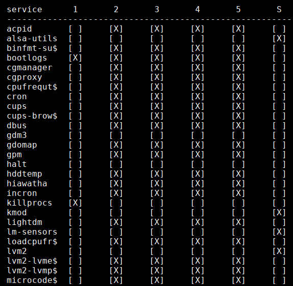

---

# Init systems - overview

This is a quick overview of some popular [init systems](https://wikipedia.org/wiki/Init), not a complete documentation of all their features. Init systems not being actively used in current distributions were left out. Implementation details are omitted, things are simplified and generalized, sometimes at the expense of accuracy. This is deliberate, in order to keep this as readable as possible by normal users and administrators. The goal is to show main differences in the basic concepts, highlights, drawbacks, and use cases.

### About init

>"When your system starts up, something has to make all the crap run."
>
><cite> - Jim Kinney, DragonCon 2015, [video](https://youtu.be/5CKW06TaEVk?t=132)</cite>

Init is the first process (PID1) started by the kernel, and continues running until the system is shut down. In other words, if it stops, for any reason, your system stops working with it. Every init system out there has to do a few important things: initialize system at boot, manage services while the system is running, and finally shutdown or reboot the system.

Init commands were historically designed to run serially, in a sequence. Later as computer hardware became more powerful, software parallelization became necessary as the means of taking advantage of this trend (see [Amdahl's-Gustaffson's trend](https://software.intel.com/en-us/articles/amdahls-law-gustafsons-trend-and-the-performance-limits-of-parallel-applications) and limits of parallelization study). This trend was also applied to modern designs of init systems. Unfortuantely, absolute boot parallelization is impossible due to dependencies. Some tasks cannot be started, unless others finished. A logfile cannot be written until the filesystem is mounted, the filesystem cannot be mounted until it was checked for errors, filesytems cannot be checked until all devices are available... 

Running computer tasks in parallel is generally much more complicated than simple serial execution. It is something that operating systems were designed to do, and even they used to suck at it. And when these tasks depend on each others results, the problem gets even harder and the solution more complex. For modern, powerful systems where boot speed is absolutely crucial and has even higher priority than stability or reliability, a parallel boot stage should definitely be considered. How big speedup are we talking about? A combined serial-parallel boot of [runit](#runit) on a slow single-CPU core was measured at [around 5 seconds](https://github.com/cloux/aws-devuan#ec2-linux-ami-comparison). If you need to boot faster, you might need a heavily parallelized init like [systemd](#systemd) on a multi-core CPU system. All approaches have advantages and disadvantages:

**Advantages of sequential init:**

 * Stable
 * Easy to follow and understand what's going on, easy to debug
 * Good fit for less powerful hardware, embedded, single-CPUs, LiveCD media

**Disadvantages of sequential init:**

 * Slow, not leveraging the power of modern hardware
 * Slow in some corner cases, like when several filesystems require [fsck](https://en.wikipedia.org/wiki/Fsck) at boot

**Advantages of parallel init:**

 * In theory tasks finish sooner when run in parallel, so you **should** get faster boot time.

**Disadvantages of parallel init:**

 * On some systems like single-CPU virtual machines or embedded systems, there is mostly no visible speed gain, since nothing truly runs in parallel. Processes might even finish slightly slower due to enforced [context switching](https://en.wikipedia.org/wiki/Context_switch).
 * On some systems parallel boot might cause a serious slowdown. This is true for example when booting from sequential media like live CD/DVDs. See [Knoppix presentation video](https://youtu.be/lDXsw2ijRkw?t=1013).

The "lifetime" of a running computer can be divided into three stages: **booting**, **running** and **shutdown**. Every init system implements these stages differently, with different level of parallelization.

#### Boot initialization

This is the first and most important stage, started immediately after kernel finishes loading. It has to be stable and flexible enough, so the system **always** starts up. Changes like new network cards or damaged filesystems have to be recognized and dealt with. To make it more stable, and for other reasons, this whole thing might be packed into an initrd image file.

Usually the process is pretty straightforward. Make sure _/dev/_ path is populated, all drives are mounted and system is ready to start applications. Optionally log what it's going on so the user can repair potential issues. If anything fails, provide an emergency shell to the user. Some modern init systems ([systemd](#systemd)) run tasks in this stage in parallel, others ([runit](#runit)) decided to keep the boot sequential.

#### Running

Management of all services and user interaction with the system normally happens here. This stage is always implemented as parallel, services and userspace programs run concurrently. Some services might depend on another services to be started first.

#### Shutdown

Logout clients, stop all services, flush data, unmount drives, and powerdown or reboot. This is farily straightforward process, rarely considered as time critical. Example are servers: when the "downtime" (shutdown system + perform maintenance tasks + start system) has to be as short as possible, both start **and** shutdown stages should be optimized for speed.

---
---
## SysVinit

With architecture design reaching back to the year 1983, this oldtimer needs no introduction. No real process supervision, no easy overview, lot of wrappers around missing features. Today, choosing SysVinit as an init system is like using floppy drives for data backups. It has been known to work for a long time, but it is obviously based on a deprecated technology. Superior solutions have been around for a long time, but until recently there was never strong enough motivation to switch and use any of them.

### Runlevels

Runlevel is a SysVinit stage, where a defined group of tasks will be started or stopped. Switching between these runlevels is done automatically by the system, or manually by the user. In theory, SysVinit supports eleven runlevels: 0123456789S. Usually only eight are being actively used: 0123456S. Of those eight, some are mostly used together. So in practice, SysVinit is used as a three level system:

 * Runlevel 1,S - Booting
 * Runlevel 2-5 - Running
 * Runlevel 6,0 - Reboot and Shutdown

To add/remove services to/from these runlevels, the services initscripts in _/etc/init.d/_ have to be symlinked into _/etc/rc{runlevel}.d/_ directories. In each runlevel, services can be set to start or stop. This is defined by the symlink name: 'S' for starting and 'K' for killing the service. And since they are always started serially, the symlink name also defines the startup order... This gets easily very confusing. To make this incomprehensible linking system manageable, additional programs are needed. This includes stuff like _update-rc.d_, _invoke-rc.d_, _sysv-rc-conf_, [hideous and kludgy](http://skarnet.org/software/s6/overview.html) _start-stop-daemon_, and workarounds like _insserv_ and _startpar_ for starting some [services in parallel](https://wiki.debian.org/BootProcessSpeedup#Parallelizing_init.d_scripts) despite the SysVinit's sequential nature...

To get a quick overview of this chaos, running `sysv-rc-conf --show=12345S` shows something like this (levels 2,3,4,5 are almost always used together as a single all-on/all-off level):

The point is, that all this complexity, extensions, and hacks are in place just to work around the main SysVinit design flaws: the unability to run anything in parallel, fixed amount of predefined runlevels and their function, and lack of service supervision.

### SysVinit Summary

**Pros:**

 * Known to be stable, and not "getting in your way"
 * Well known, documented, and supported
 * Lots of community help

**Cons:**

 * Old deprecated design compared to any other init out there
 * Counting all workarounds, it is unnecessarily complex for what it actually does
 * Services need to implement [bloated, ugly, and frustrating](http://www.safe-mbox.com/~rgooch/linux/boot-scripts/) initscripts, each reinventing the wheel and implementing the same management commands: _start_, _stop_, _restart_, _reload_ etc.

**Recommended use:**

 * Embedded devices
 * Legacy systems, not requiring features of modern init
 * Live CD/DVD media

**NOT recommended use:**

 * New GNU/Linux distributions
 * Modern systems where speed has priority

SysVinit shows its age, but there are kludgy workarounds available for almost anything. It is hardly recommended for a modern Linux distribution, but does well in older distros and on less powerful hardware. Linux SysVinit is still (as of 2018) used as default by [PCLinuxOS](http://www.pclinuxos.com), [Antix](http://antix.mepis.org), [Slackware](http://www.slackware.com), [Devuan](https://devuan.org), [Refracta](http://www.ibiblio.org/refracta/) and others.

---
---
## OpenRC

Developed as [Gentoo](https://wiki.gentoo.org/wiki/OpenRC) project, OpenRC was not designed as complete init replacement, but only a dependency-based rc (run command) that works with the init program that is provided by the system([1](https://wiki.gentoo.org/wiki/OpenRC/Baselayout_1_to_2_migration#What_is_OpenRC.3F)). It works well in conjunction with the old SysVinit, addressing some of its weaknesses while using it's widely available initscripts. [openrc-run](http://manpages.org/openrc-run/8) also provides its own interface to commands and daemons.

Similar to the [daemontools](#daemontools-family) family, OpenRC supports custom named runlevels defined simply as directories living in _/etc/runlevels_. This is a clear improvement over SysVinit with static predefined runlevels. Process _supervision_ however does not seem to be a part of OpenRC's design. It's done with some dirty and less dirty hacks which involve managing PID files to be able to start/stop processes when necessary. Current process management implementation _start-stop-daemon_ uses this scheme with some known flaws like positive false PID acquisition([2](https://wiki.gentoo.org/wiki/Process-Supervision#Rationale)). This approach has the same issues as the old SysVinit scheme. Alternatively, a foreign supervisor like _runit_ or _s6_([3](https://github.com/OpenRC/openrc/blob/master/s6-guide.md)) can be used, or you can develop your own supervision([4](https://wiki.gentoo.org/wiki/Process-Supervision#OpenRC_supervision_backend)). There are attempts to make a native service supervision for OpenRC like the [supervise-daemon](https://github.com/OpenRC/openrc/blob/master/supervise-daemon-guide.md), but this requires special, customized initscripts that do not allow the daemon to fork... 

While you could use [s6](#s6) or [runit](#runit) together with OpenRC, the real question is: why then keep OpenRC and complicate things, when both _s6_ and _runit_ already offer complete init systems?

**Pros:**

 * Considerable improvement over SysVinit
 * Easy migration path, leveraging many existing initscripts
 * Custom runlevels
 * Configurable service dependencies

**Cons:**

 * Not designed as a complete init system from the groud up
 * Clunky service supervision

**Recommended use:**

 * Existing Linux distributions searching for SysVinit upgrade

**NOT recommended use:**

 * New GNU/Linux distributions
 * If service supervision is required

While not designed as complete full-featured init system, OpenRC provides an easy migration path from SysVinit for existing distributions. OpenRC is becoming very popular, now being used as default in [Artix](https://artixlinux.org), [Alpine Linux](https://alpinelinux.org), and it is being considered for Devuan Ceres and following versions.

---
---
## Daemontools Family

Also dubbed the Maxwell's equations of Unix process supervision([1](http://blog.darknedgy.net/technology/2015/09/05/0/)), the [daemontools](http://cr.yp.to/daemontools.html) suite was developed by cryptologist Daniel J. Bernstein in 1997([2](https://jdebp.eu/FGA/daemontools-family.html)) as a completely new, modern approach to service management. daemontools is just a supervision suite and does not include any PID1 init process binary. The latest version 0.76 was released in 2001 and is not actively developed anymore, but its innovative design inspired some other popular init suites: notably [runit](#runit) and [s6](#s6).

**Common daemontools concepts:**

 * No PID-files used, ever. Supervisor communicates with the services directly, including starting, stopping and sending signals.
 * Supervisor monitors and restarts services automatically if they die.
 * Services write their messages to stdout, which gets redirected to logfiles by the supervisor.
 * In order to be supervised, service programs must run in foreground.  
  This is common to all supervised init systems, including [systemd](#systemd).
 * Service definitions are in simple "_run_" scripts.  
  This can be as simple as a [single line to start nginx](https://github.com/cloux/aws-devuan/blob/master/etc/sv/nginx/run) webserver, up to a "heavy" 15 lines needed to [start a PostgreSQL Cluster](https://github.com/cloux/aws-devuan/blob/master/etc/sv/postgresql/run). Compared to a [400-line nginx SysVinit initscript](https://github.com/JasonGiedymin/nginx-init-ubuntu/blob/master/nginx) full of ugly hacks like _wait_for_pid_, the one-liner for daemontools seems so unreal... but it works, and it does exactly the same job.

---
---
## Runit

>"Process supervision TLDR: Use runit."
>
><cite>Joshua Timberman, "[Process Supervision: Solved Problem](http://jtimberman.housepub.org/blog/2012/12/29/process-supervision-solved-problem/)" (2012-12)

runit design directly resembles the three main "lifetime" stages of a computer: **booting**, **running**, and **shutdown**, which are represented by three scripts named _1_,_2_ and _3_ placed in _/etc/runit/_. The first _boot_ stage runs all commands sequentially. The second _running_ stage just starts the service supervisor, which runs services in parallel. The third _shutdown_ stage runs everything sequentially again.

In the early boot, the command dependencies are heavy, very little can be done in parallel. Here the sequential execution offers stability, easy configurability and maintenance, while the speed sacrifice compared to a parallel boot is very low. The boot stage of runit can even fully initialize the system and completely replace [initrd](https://www.kernel.org/doc/html/v4.12/admin-guide/initrd.html). This direct initrd-free boot offers additional speedup and configuration flexibility, and this is exactly how the [Devuan+Runit for AWS EC2](https://github.com/cloux/aws-devuan) is built.

In the second supervised running stage, where service dependencies are less prominent, everything is simply run in parallel. This serial-boot/parallel-supervision design strikes a good balance between simplicity and resource usage, offering sufficient system for many use cases. The supervisor program might optionally manage services in groups, also called "runlevels". This is different from [SysVinit](#sysvinit), where the runlevels are predefined for all stages.

runit works very well with symlinks and resolves them properly. This allows for some tricks in service definitions, like implementation of agetty-1..6 just symlinked to [agetty-generic](https://github.com/cloux/aws-devuan/tree/master/etc/sv/agetty-generic). runit's supervisor control `sv` also understands when it is symlinked in place of an initscript, e.g.:

`mv /etc/init.d/mysql /etc/init.d/mysql.orig; ln -s /usr/bin/sv /etc/init.d/mysql`

then running `/etc/init.d/mysql start` works! This means perfect backward compatibility with initscripts. `sv` also supports service names or full service paths, which allows for unique simplicity. Even using tricks like glob matching is allowed:  
`sv stop /etc/service/agetty*` is a valid command, stopping all supervised _agetty_ services. Another use case:

**How to quickly find services that should be running, but refuse to start?**

`sv status /etc/service/* | grep 'want up'`

That's it. Simple. Even better, you can just use 's' instead of 'status', so `sv s /etc/service/*` works just fine.

How would you do that in SysVinit? Since it's not supervised it is impossible to do it directly. It could be done, but a huge, ugly, bloated workaround would be necessary, like for everything else in SysVinit. The [systemd](#systemd) wrapper command `service --status-all` could be used, but it shows status for all installed services, regardless if they are active in current runlevel or not. In systemd you can see all services that should start at boot: `systemctl list-unit-files --state=enabled`, services either running or exited: `systemctl list-units --type=service | grep active`... but still, none of them really shows what I want to see. Maybe there is a command for it, but google can't seem to find it.

**Pros:**

 * Complete init including PID1 binary, service supervisor and logging subsystem
 * Simple to setup, configure and maintain
 * Easy to learn and understand command syntax

**Cons:**

 * Only basic, indirect support for service dependencies
 * Weird [svlogd](http://smarden.org/runit/svlogd.8.html) logger filter configuration syntax([1](http://smarden.org/runit/svlogd.8.html#sect7))

**Recommended use:**

 * Critical systems with high priority for security, reliability and stability
 * Init replacement in existing systems
 * New distributions
 * Embedded systems
 * Servers
 
**NOT recommended use:**

 * General purpose Linux distributions (s6 might cover more use cases)
 * Replacement in existing systems heavily dependent on existing SysVinit scripts

Used as default by [VOID](https://www.voidlinux.eu), [Dragora](http://www.dragora.org/), and as the init of choice in my [AWS EC2 Devuan GNU/Linux](https://github.com/cloux/aws-devuan) distribution.

---
---
## s6 
 
The "**s**karnet.org's **s**mall and **s**ecure **s**upervision **s**oftware **s**uite" (s6) is being developed by a single engineer - Laurent Bercot, and is the most advanced init in the daemontools family. Powerful functionality, in a relatively small amount of code. Consists of more than 60 (sixty) commands and libraries for system initialization, service supervision, dependency management, inter-process synchronization, access control, privilege gain, advanced logging, and then some([1](https://skarnet.org/software/s6/index.html)). If you can think of it, s6 has it. Even features you don't really need, like socket activation: "It's important to realize that you don't need socket activation. It's a marketing word used by systemd advocates that mixes a couple useful architecture concepts and several horrible ideas, for a very minor speed benefit"([2](https://skarnet.org/software/s6/socket-activation.html)). This is a bold statement, the author doesn't try to sell you on anything. You are not required to use all the features of s6, nothing is forced upon you. All commands and libraries are fairly independent, can be used separately and easily combined with other init systems.

**Pros:**

 * Complete init system: PID1 binary, service supervisor, advanced logging with regex filter support([3](https://skarnet.org/software/s6/s6-log.html))
 * Actively maintained and continuously expanded([4](https://git.skarnet.org/cgi-bin/cgit.cgi/s6/))
 * Lots of features
 
**Cons:**

 * More complex system, steeper learning curve compared to runit
 * Unusual service control commands: uses `-wu` instead of `start`, `-wd` instead of `down`...

**Recommended use:**

 * New general-purpose Linux distributions
 * Critical infrastructure, servers
 * When stable, secure design together with advanced features are required

**NOT recommended:**

 * Beginners searching for an easy way to replace current init

Being the most universal and advanced init today, s6 should be a good fit for almost any purpose. Currently, s6 is the default init in [Obarun](https://obarun.org) GNU/Linux.

---
---
## systemd

is the newest and coolest init of the bunch. Since it's start in 2010, a lot has been written about systemd. It caused rants, heated discussions, divided communities, forked Linux distributions, local earthquakes and global warming. After all this mayhem, there is only one question left: "When should I use this, and when should I avoid it?" Let us learn something from the experiences of other developers, implementers and users. Here are few relevant quotes:

>"The complex systemd collection of services glues together formerly detached subsystems, adding a GUI around formerly modular tasks in order to analyze log files, manage sessions, control subsystems... My personal problem with systemd is that I just don't need any of this. For exmaple, systemd was not developed with DVD systems in mind: slow latency data is not meant to be used for parallelized system startup. At the end, about 5% of the time would be spent on reading data, and 95% on mechanical movement and latency. systemd tries to parallelize tasks as much as possible, and this is a real killer for slow systems."
>
><cite> - Klaus [Knopper](http://www.knopper.net/index-en.html), author of [Knoppix](http://knoppix.net): presentation [video](https://youtu.be/lDXsw2ijRkw?t=1013) (Apr 2016)</cite>

As of now (2018), systemd positioned itself as the prime choice in all major distributions. RedHat, SuSE, Fedora, Debian, Ubuntu, Arch, CentOS... all using systemd as the default and exclusive choice. It is not generally possible to switch to another init without switching to another distribution. You want [Debian](https://www.debian.org) without systemd? Switch to [Devuan](https://devuan.org). Want [Arch](https://www.archlinux.org) without systemd? Switch to [ArtiX](https://artixlinux.org). Want [Fedora](https://www.fedoraproject.org) without systemd? Good luck. While positioned as the only "choice", it is obviously a bad fit for many use cases. That includes not only LiveCD boots, but also more modern usage, like running containers:

>"I cared very much about reliably managing things at scale. Having seen odd errors with systemd and Docker I started digging into the issue. As it turns out, systemd cannot effectively monitor Docker containers due to the incompatibility with the two architectures. When looking at our use case for RancherOS, we realized we did not need systemd to run Docker. In fact, we didn't need any supervisor to sit at PID 1."
>
><cite> - Darren Shepherd [announcing RancherOS](http://rancher.com/announcing-rancher-os)</cite>

Some people argued, that systemd process is "[pretty minimal](https://lists.archlinux.org/pipermail/arch-general/2012-April/026317.html)". This might have been true in 2012. As of 2018, my systemd version 236-2 PID1 binary is around 1.65 MB big. That is a lot of functionality, lot of complexity, and a lot of things that might go wrong. Compare that to 100x smaller, 14 kB binary of [runit](#runit), that performs the same basic task. systemd seems to integrate a lot of things that are not really necessary or justified to be a part of init system. Despite of this multitude of advanced [functionality](http://0pointer.de/blog/projects/why.html) (sometimes dubbed ["scope creep"](https://www.wikizero.com/en/Systemd#Criticism) by systemd's opponents), it is not the best fit for everything.

The "marketing" claims about systemd and public reactions to it are very much reminiscent of the  "[Emperors new clothes](https://en.wikipedia.org/wiki/The_Emperor%27s_New_Clothes)" story. People who understand the systemd internals, recognize and comment on this situation:

>"The systemd propaganda machine works, and has already taught you to think in systemd terms - which, let it be said openly, are often pure marketing bullshit. Socket activation. This has to be my new favorite marketing buzzword (My sockets are activated. I put my feet into them, and now they move. It's awesome). As systemd defines it, is a hack that mixes several different already existing concepts in a shaker, and what you get in the end is worse than if you had nothing at all - but since everything is mixed and confused, nobody notices, and systemd can pretend it's doing that wonderful thing that no other system does, and people believe it."
>
><cite> - Laurent Bercot, author of [s6](#s6) init suite: [skarnet archive](http://skarnet.org/cgi-bin/archive.cgi?2:mss:423)</cite>

How about the discussion and openness? Does the community agree on where the project is going? Is there even a community? Or is it more centralized development, where a small group of project leaders makes all important decisions in secret? The main systemd developer claimed, that:
>"...this myth that there was a group of people who meet and then agree on how the future free systems look like, is entirely bogus."
>
><cite> - Lennart Poettering, [The Biggest Myths](http://0pointer.de/blog/projects/the-biggest-myths.html), Part 9. (2013-01-26)</cite>

only to refute himself later:
>"The systemd cabal (Kay Sievers, Harald Hoyer, Daniel Mack, Tom Gundersen, David Herrmann, and yours truly) recently met in Berlin about all these things, and tried to come up with a scheme that is somewhat simple, but tries to solve the issues generically, for all use-cases, as part of the systemd project."
>
><cite> - Lennart Poettering, [Revisiting How We Put Together Linux Systems](http://0pointer.net/blog/revisiting-how-we-put-together-linux-systems.html) (2014-09-01)</cite>

He talks about a meeting, where the systemd developers decided to integrate even software distribution and update mechanism directly into systemd. Why it's necessary to have the software management and updates locked onto a particular init system, remains unexplained. This universal plan towards a singular systemd/Linux distribution is further step from diversity to uniformity, marginalizing various needs of a large portion of the Linux user base.

So, why every major distribution implemented systemd as the default (and many times the **only**) init system? While the official argument ["because everyone else does"](https://wiki.debian.org/Debate/initsystem/systemd#Why_Debian_should_default_to_systemd) became a self-fulfilling prophecy, the technical arguments, comparisons, and [concerned voices](https://wiki.debian.org/Debate/initsystem/sysvinit) remain unheard. By now, the attitude behind systemd is very clear: fall in line, or go [fork](https://guides.github.com/activities/forking/) yourself. Some forks are now gaining interest in the commercial world. After systemd kept causing financial lossess when twisted into a use case for which it was not designed, it had to be replaced:

>"We tried to build our datacenter on Debian and Ubuntu, but servers that don't boot, that don't reboot or systemd-resolved that constantly interferes with our core network configuration made it too expensive to run Debian or Ubuntu. Yes, you read right: too expensive. We are a small team and we simply don't have the time to fix problems caused by systemd on a daily basis. With systemd the main advantage to use Linux is obsolete."
>
><cite> - Nico Schottelius, CEO at [ungleich glarus ltd](https://www.ungleich.ch), about [The importance of Devuan](https://blog.ungleich.ch/en-us/cms/blog/2017/12/10/the-importance-of-devuan/), 2017-12-10</cite>

### systemd Summary

**Pros:**

 * Systemd is actively maintained live project
 * Backed by a big stable software company
 * Used as default by all major distributions
 * Lots of community and commercial support
 * Lots of features
 
**Cons:**

 * Many acclaimed engineers and experts pointed out basic design flaws
 * systemd developers have exceptionally [lame responses to security](https://www.theregister.co.uk/2017/07/28/black_hat_pwnie_awards/) issues
 * Known to cause direct financial losses in datacenter environment
 * May cause further issues in systems not explicitly considered by the main developers

**Recommended use cases:**

 * Personal computers with fast multi-core CPUs
 * Systems where low-level customization by the user is not expected
 * Systems where _speed_ or _coolness_ have higher priority than _stability_

**NOT recommended use cases:**

 * Critical infrastructure
 * Long-running appliances, servers
 * Systems where compromised security could be an issue
 * Thin or embedded devices with limited hardware capabilities, like routers
 * Live CD/DVD media

Looking at the above pros/cons and recommended use of systemd, exactly the same bulletpoints would fit well to another system: Microsuck Winblows. Which is not inherently a problem, if you incorporate this information into your evaluation process. If you have a non-technical friend, looking for a open-source remake for his PC or laptop, many distributions running systemd are a great start: [Ubuntu](https://www.ubuntu.com/desktop), [Solus](https://solus-project.com), [Zorin OS](https://zorinos.com)... all of them are very beautiful, full-featured modern desktops. Many users could even be easily fooled that this **is** a new version of Winblows (I tried, they are). Interesting is, that many experts looking at systemd **are** convinced that this is a new Winblows ([1](https://skarnet.org/software/s6/systemd.html)),([2](https://www.infoworld.com/article/2608870/linux/you-have-your-windows-in-my-linux.html)),([3](http://www.zdnet.com/article/linus-torvalds-and-others-on-linuxs-systemd/)).

---
---
## Conclusion

Each init system has it's strengths and weaknesses. It is important to know and understand them, to be able to pick the right tool for the job. There is no single best init system for everything, and there is no init that would be bad or useless. If you feel your init is the weak part of your system, then the init you picked is not a good fit for what you are trying to do. Re-evaluate and try again, see [Engineering vs. Development](/engineering).

 

cloux@rote.ch (2018)

